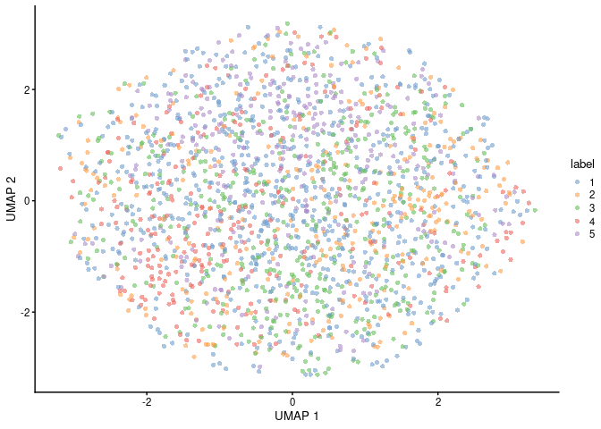

<!-- README.md is generated from README.Rmd. Please edit that file -->

# BPCells backend for DelayedArray objects

<!-- badges: start -->

<!-- badges: end -->

BPCells is a package for high performance single cell analysis on
RNA-seq and ATAC-seq datasets. This package just bring BPCells into
Bioconductor single-cell workflow.

All operations in `BPCells` are lazy, which means that no real work is
performed on matrix or fragment objects until the result needs to be
returned as an R object or written to disk. And most operations have
been optimized by c++ or c.

Here is a summarized delayed operations in BPCells:

| Operations                               | BPCells                     | BPCellsArray                 |
| ---------------------------------------- | --------------------------- | ---------------------------- |
| Combine by row                           | rbind2                      | rbind2,rbind,arbind,bindROWS |
| Combine by column                        | cbind2                      | cbind2,cbind,acbind,bindCOLS |
| transpose matrix                         | t                           | t                            |
| subset                                   | `[`                         | `[`                          |
| Rename                                   | `dimnames<-`                | `dimnames<-`                 |
| Multiplication                           | `%*%`                       | `%*%`                        |
| Crossproduct                             |                             | crossprod                    |
| Arithmetic                               | `+`,`-`,`*`,`/`             | `+`,`-`,`*`,`/`              |
| Relational Operators                     | Binary (`<`,`>`,`<=`, `>=`) | Binary (`<`,`>`,`<=`, `>=`)  |
| Storage mode                             | convert\_matrix\_type       | convert\_type                |
| Rank-transform                           | rank\_transform             | rank\_transform              |
| Mask matrix entries to zero              | mask\_matrix                | mask\_matrix                 |
| Take minumum with a global constant      | min\_scalar                 | pmin\_scalar                 |
| Take the minimum with a per-col constant | min\_by\_col                | pmin\_by\_col                |
| Take the minimum with a per-row constant | min\_by\_row                | pmin\_by\_row                |
| Round number                             | round                       | round                        |
| `exp(x) - 1`                             | `expm1_slow`,`expm1`        | `expm1_slow`,`expm1`         |
| log(1+x)                                 | `log1p`,`log1p_slow`        | `log1p`,`log1p_slow`         |
| Power                                    | `pow_slow`,`^`              | `pow_slow`,`^`               |

Other non-lazied operations:

| Operations        | BPCells          | BPCellsArray                    | Note             |
| ----------------- | ---------------- | ------------------------------- | ---------------- |
| row/col summarize | matrix\_stats    | matrix\_stats                   |                  |
| row summarize     | rowSums,rowMeans | rowSums,rowMeans,rowVars,rowSds |                  |
| col summarize     | colSums,colMeans | colSums,colMeans,colVars,colSds |                  |
| Multiplication    | %\*%             | %\*%                            | For some methods |
| Crossproduct      |                  | crossprod                       | For some methods |
| svd               | svds             | `runSVD`+`SpectraParam`         |                  |

## Matrix Storage Format

BPCells provide three format:

1.  Directory of files
      - read: `readBPCellsDirMatrix`
      - write: `writeBPCellsDirArray`
2.  Hdf5 file
      - read: `readBPCellsHDF5Matrix`
      - write: `writeBPCellsHDF5Array`
3.  in memory
      - write: `writeBPCellsMemArray`

Matrices can be stored in a directory on disk, in memory, or in an HDF5
file. Saving in a directory on disk is a good default for local
analysis, as it provides the best I/O performance and lowest memory
usage. The HDF5 format allows saving within existing hdf5 files to group
data together, and the in memory format provides the fastest performance
in the event memory usage is unimportant. So when using `as(object,
"BPCellsArray")` or `as(object, "BPCellsMatrix")`, the default behavior
will be `as(object, "BPCellsDirMatrix")`.

Details see:
<https://bnprks.github.io/BPCells/articles/web-only/bitpacking-format.html>

``` r
library(BPCellsArray)
library(SingleCellExperiment)
#> Loading required package: SummarizedExperiment
#> Loading required package: MatrixGenerics
#> Loading required package: matrixStats
#> 
#> Attaching package: 'matrixStats'
#> The following objects are masked from 'package:BPCellsArray':
#> 
#>     colSds, colVars, rowSds, rowVars
#> 
#> Attaching package: 'MatrixGenerics'
#> The following objects are masked from 'package:matrixStats':
#> 
#>     colAlls, colAnyNAs, colAnys, colAvgsPerRowSet, colCollapse,
#>     colCounts, colCummaxs, colCummins, colCumprods, colCumsums,
#>     colDiffs, colIQRDiffs, colIQRs, colLogSumExps, colMadDiffs,
#>     colMads, colMaxs, colMeans2, colMedians, colMins, colOrderStats,
#>     colProds, colQuantiles, colRanges, colRanks, colSdDiffs, colSds,
#>     colSums2, colTabulates, colVarDiffs, colVars, colWeightedMads,
#>     colWeightedMeans, colWeightedMedians, colWeightedSds,
#>     colWeightedVars, rowAlls, rowAnyNAs, rowAnys, rowAvgsPerColSet,
#>     rowCollapse, rowCounts, rowCummaxs, rowCummins, rowCumprods,
#>     rowCumsums, rowDiffs, rowIQRDiffs, rowIQRs, rowLogSumExps,
#>     rowMadDiffs, rowMads, rowMaxs, rowMeans2, rowMedians, rowMins,
#>     rowOrderStats, rowProds, rowQuantiles, rowRanges, rowRanks,
#>     rowSdDiffs, rowSds, rowSums2, rowTabulates, rowVarDiffs, rowVars,
#>     rowWeightedMads, rowWeightedMeans, rowWeightedMedians,
#>     rowWeightedSds, rowWeightedVars
#> Loading required package: GenomicRanges
#> Loading required package: stats4
#> Loading required package: BiocGenerics
#> 
#> Attaching package: 'BiocGenerics'
#> The following objects are masked from 'package:stats':
#> 
#>     IQR, mad, sd, var, xtabs
#> The following objects are masked from 'package:base':
#> 
#>     anyDuplicated, aperm, append, as.data.frame, basename, cbind,
#>     colnames, dirname, do.call, duplicated, eval, evalq, Filter, Find,
#>     get, grep, grepl, intersect, is.unsorted, lapply, Map, mapply,
#>     match, mget, order, paste, pmax, pmax.int, pmin, pmin.int,
#>     Position, rank, rbind, Reduce, rownames, sapply, setdiff, sort,
#>     table, tapply, union, unique, unsplit, which.max, which.min
#> Loading required package: S4Vectors
#> 
#> Attaching package: 'S4Vectors'
#> The following object is masked from 'package:utils':
#> 
#>     findMatches
#> The following objects are masked from 'package:base':
#> 
#>     expand.grid, I, unname
#> Loading required package: IRanges
#> Loading required package: GenomeInfoDb
#> Loading required package: Biobase
#> Welcome to Bioconductor
#> 
#>     Vignettes contain introductory material; view with
#>     'browseVignettes()'. To cite Bioconductor, see
#>     'citation("Biobase")', and for packages 'citation("pkgname")'.
#> 
#> Attaching package: 'Biobase'
#> The following object is masked from 'package:MatrixGenerics':
#> 
#>     rowMedians
#> The following objects are masked from 'package:matrixStats':
#> 
#>     anyMissing, rowMedians
```

Let’s prepare some data for analysis

``` r
set.seed(1L)
path <- tempfile("BPCells")
sce <- scuttle::mockSCE(2000L, 3000L)
format(object.size(assay(sce, "counts")), "MB")
#> [1] "46.1 Mb"
```

What we need to do is transform the counts matrix into a
`BPCellsDirMatrix` object.

``` r
assay(sce, "counts") <- writeBPCellsDirArray(
    assay(sce, "counts"),
    path = path
)
#> Warning: Matrix compression performs poorly with non-integers.
#> • Consider calling convert_matrix_type if a compressed integer matrix is intended.
#> This message is displayed once every 8 hours.
format(object.size(assay(sce, "counts")), "MB")
#> [1] "0.3 Mb"
```

The path store the data can be obtained by `path` function.

``` r
identical(path(assay(sce, "counts")), path)
#> [1] TRUE
```

We can inspect the assay info by print it. Attention the class name.

``` r
assay(sce, "counts")
#> 3000 x 2000 DelayedMatrix object with class BPCellsDirMatrix
#> 
#> Row names: Gene_0001, Gene_0002 ... Gene_3000
#> Col names: Cell_001, Cell_002 ... Cell_2000
#> 
#> Data type: double
#> Storage order: column major
#> 
#> Queued Operations:
#> 1. Load compressed matrix from directory /tmp/RtmpmXAZgW/BPCells33ed53291e4b5a
```

If you do delayed operations with this assay, the class may be changed,
that’s because all of BPCells operations are lazy, no real work is
performed on the matrix until the result needs to be returned as an R
object or written to disk. You can coerce it into a dense matrix or
`dgCMatrix` to get a actual R object.

``` r
assay(sce, "counts")[1:10, 1:10]
#> 10 x 10 DelayedMatrix object with class BPCellsMatrix
#> 
#> Row names: Gene_0001, Gene_0002 ... Gene_0010
#> Col names: Cell_001, Cell_002 ... Cell_010
#> 
#> Data type: double
#> Storage order: column major
#> 
#> Queued Operations:
#> 1. Load compressed matrix from directory /tmp/RtmpmXAZgW/BPCells33ed53291e4b5a
#> 2. Select rows: 1, 2 ... 10 and cols: 1, 2 ... 10
as.matrix(assay(sce, "counts")[1:10, 1:10])
#>           Cell_001 Cell_002 Cell_003 Cell_004 Cell_005 Cell_006 Cell_007
#> Gene_0001        0        0        0        0       51        0       16
#> Gene_0002      188       61        0        2       15       33      129
#> Gene_0003      625      897     1324      289     1374      260      611
#> Gene_0004        0        0        0        0        0        0        0
#> Gene_0005        0        2        1        8        0        9        0
#> Gene_0006        0        2       40       79        1        0        0
#> Gene_0007        0        7        0        0        0        0      176
#> Gene_0008      198       78       21       24       51       52      506
#> Gene_0009      464      494       21       91      697      695      677
#> Gene_0010       52      142        1       14        8      353       58
#>           Cell_008 Cell_009 Cell_010
#> Gene_0001        0        0        0
#> Gene_0002       53       20      107
#> Gene_0003       70      349      433
#> Gene_0004        9        0        0
#> Gene_0005        5        1       34
#> Gene_0006     1128        0       49
#> Gene_0007        0        0       56
#> Gene_0008      244      146       74
#> Gene_0009     1578      135      167
#> Gene_0010      335      454      157
as(assay(sce, "counts")[1:10, 1:10], "dgCMatrix")
#> 10 x 10 sparse Matrix of class "dgCMatrix"
#>   [[ suppressing 10 column names 'Cell_001', 'Cell_002', 'Cell_003' ... ]]
#>                                                     
#> Gene_0001   .   .    .   .   51   .  16    .   .   .
#> Gene_0002 188  61    .   2   15  33 129   53  20 107
#> Gene_0003 625 897 1324 289 1374 260 611   70 349 433
#> Gene_0004   .   .    .   .    .   .   .    9   .   .
#> Gene_0005   .   2    1   8    .   9   .    5   1  34
#> Gene_0006   .   2   40  79    1   .   . 1128   .  49
#> Gene_0007   .   7    .   .    .   . 176    .   .  56
#> Gene_0008 198  78   21  24   51  52 506  244 146  74
#> Gene_0009 464 494   21  91  697 695 677 1578 135 167
#> Gene_0010  52 142    1  14    8 353  58  335 454 157
```

Of cause, you can do the operations directly on the
`SingleCellExperiment` object.

``` r
identical(assay(sce[1:10, 1:10]), assay(sce, "counts")[1:10, 1:10])
#> [1] TRUE
```

Again, no real work is performed on the matrix until the result needs to
be returned as an R object or written to disk. Attention the `Queued
Operations` information.

``` r
sce <- scuttle::logNormCounts(sce)
assay(sce, "logcounts")
#> 3000 x 2000 DelayedMatrix object with class BPCellsMatrix
#> 
#> Row names: Gene_0001, Gene_0002 ... Gene_3000
#> Col names: Cell_001, Cell_002 ... Cell_2000
#> 
#> Data type: double
#> Storage order: column major
#> 
#> Queued Operations:
#> 1. Load compressed matrix from directory /tmp/RtmpmXAZgW/BPCells33ed53291e4b5a
#> 2. Scale columns by 0.984, 1.05 ... 1
#> 3. Transform log1p
#> 4. Scale by 1.44
```

Both `count` and `logcounts` share the same disk path.

``` r
identical(path(assay(sce, "counts")), path(assay(sce, "logcounts")))
#> [1] TRUE
```

``` r
dec_sce <- scran::modelGeneVar(sce)
#> Warning in regularize.values(x, y, ties, missing(ties), na.rm = na.rm):
#> collapsing to unique 'x' values
set.seed(1L)
scater::runPCA(sce,
    subset_row = scran::getTopHVGs(dec_sce, n = 2000L),
    BSPARAM = BiocSingular::IrlbaParam()
)
#> class: SingleCellExperiment 
#> dim: 3000 2000 
#> metadata(0):
#> assays(2): counts logcounts
#> rownames(3000): Gene_0001 Gene_0002 ... Gene_2999 Gene_3000
#> rowData names(0):
#> colnames(2000): Cell_001 Cell_002 ... Cell_1999 Cell_2000
#> colData names(4): Mutation_Status Cell_Cycle Treatment sizeFactor
#> reducedDimNames(1): PCA
#> mainExpName: NULL
#> altExpNames(1): Spikes
```

BPCells has implement a C++ Spectra solver for SVD calculation,
`BPCellsArray` has wrap it into `SpectraParam`, the same format with
other `BiocSingular` function.

``` r
set.seed(1L)
sce <- scater::runPCA(sce,
    subset_row = scran::getTopHVGs(dec_sce, n = 2000L),
    BSPARAM = SpectraParam()
)
colLabels(sce) <- scran::clusterCells(
    sce,
    use.dimred = "PCA",
    BLUSPARAM = bluster::SNNGraphParam(
        k = 20L, type = "jaccard",
        cluster.fun = "leiden",
        cluster.args = list(
            objective_function = "modularity",
            resolution_parameter = 1,
            n_iterations = -1L # undocumented characteristics
        ),
        BNPARAM = BiocNeighbors::AnnoyParam()
    )
)
sce <- scater::runUMAP(
    sce,
    dimred = "PCA",
    n_neighbors = 10L,
    min_dist = 0.3,
    metric = "cosine",
    external_neighbors = TRUE,
    BNPARAM = BiocNeighbors::AnnoyParam()
)
scater::plotReducedDim(
    sce, "UMAP",
    colour_by = "label",
    point_shape = 16,
    point.padding = 0,
    force = 0
)
```


