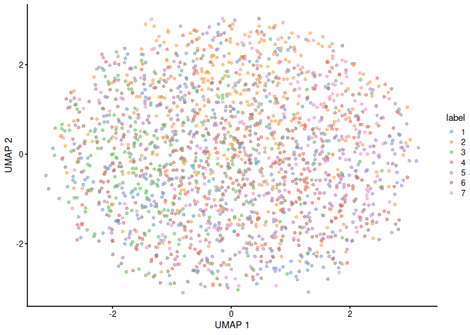

<!-- README.md is generated from README.Rmd. Please edit that file -->

# BPCells backend for DelayedArray objects

<!-- badges: start -->

[](https://github.com/Yunuuuu/BPCellsArray/actions/workflows/R-CMD-check.yaml)
<!-- badges: end -->

## Installation

To install from Bioconductor, use the following code:

``` r
if (!requireNamespace("BiocManager", quietly = TRUE)) {
    install.packages("BiocManager")
}
BiocManager::install("BPCellsArray")
```

You can install the development version of `BPCellsArray` from
[GitHub](https://github.com/Yunuuuu/BPCellsArray) with:

``` r
if (!requireNamespace("pak")) {
    install.packages("pak",
        repos = sprintf(
            "https://r-lib.github.io/p/pak/devel/%s/%s/%s",
            .Platform$pkgType, R.Version()$os, R.Version()$arch
        )
    )
}
pak::pkg_install("Yunuuuu/BPCellsArray@main")
```

## Introduction

BPCells is a package for high performance single cell analysis on
RNA-seq and ATAC-seq datasets. This package just bring BPCells into
Bioconductor single-cell workflow.

Almost all operations in `BPCells` are lazy, which means that no real
work is performed on `BPCellsMatrix` objects until the result needs to
be returned as an R object or written to disk. And most operations have
been optimized by `c++` or `c`. Although `DelayedArray` package provides
block processing for most usual operations, `BPCellsArray` re-dispatch
these methods to use the optimized methods in BPCells.

Here is a summarized delayed operations in BPCells:

| Operations                               | BPCells                     | BPCellsArray                           |
|------------------------------------------|-----------------------------|----------------------------------------|
| Combine by row                           | rbind2                      | rbind2,rbind,arbind,bindROWS           |
| Combine by column                        | cbind2                      | cbind2,cbind,acbind,bindCOLS           |
| transpose matrix                         | t                           | t                                      |
| subset                                   | `[`                         | `[`                                    |
| Rename                                   | `dimnames<-`                | `dimnames<-`,`rownames<-`,`colnames<-` |
| Multiplication                           | `%*%`                       | `%*%`                                  |
| Crossproduct                             |                             | crossprod                              |
| Matrix product transpose                 |                             | tcrossprod                             |
| Arithmetic                               | `+`,`-`,`*`,`/`             | `+`,`-`,`*`,`/`                        |
| Relational Operators                     | Binary (`<`,`>`,`<=`, `>=`) | Binary (`<`,`>`,`<=`, `>=`)            |
| Storage mode                             | convert_matrix_type         | convert_mode                           |
| Rank-transform                           | rank_transform              | `rank_transform`,`rowRanks`,`colRanks` |
| Mask matrix entries to zero              | mask_matrix                 | mask_matrix                            |
| Take minumum with a global constant      | min_scalar                  | pmin_scalar                            |
| Take the minimum with a per-col constant | min_by_col                  | pmin_by_col                            |
| Take the minimum with a per-row constant | min_by_row                  | pmin_by_row                            |
| Round number                             | round                       | round                                  |
| `exp(x) - 1`                             | `expm1_slow`,`expm1`        | `expm1_slow`,`expm1`                   |
| `log(1+x)`                               | `log1p`,`log1p_slow`        | `log1p_single`,`log1p`                 |
| Power                                    | `pow_slow`,`^`              | `pow_slow`,`^`                         |

Other non-lazied operations:

| Operations               | BPCells                  | BPCellsArray                    | Note             |
|--------------------------|--------------------------|---------------------------------|------------------|
| row/col summarize        | matrix_stats             | matrix_stats                    |                  |
| row summarize            | rowSums,rowMeans,rowVars | rowSums,rowMeans,rowVars,rowSds |                  |
| col summarize            | colSums,colMeans,colVars | colSums,colMeans,colVars,colSds |                  |
| Multiplication           | %\*%                     | %\*%                            | For some methods |
| Crossproduct             |                          | crossprod                       | For some methods |
| Matrix product transpose |                          | tcrossprod                      | For some methods |
| svd                      | svds                     | `runSVD`+`SpectraParam`         |                  |

## Matrix Storage Format

BPCells provide following formats:

1.  Directory of files
    - read: `readBPCellsDirMatrix`
    - write: `writeBPCellsDirMatrix`
2.  HDF5 file
    - read: `readBPCellsHDF5Matrix`
    - write: `writeBPCellsHDF5Matrix`
3.  10x HDF5 file
    - read: `readBPCells10xHDF5Matrix`
    - write: `writeBPCells10xHDF5Matrix`
4.  in memory
    - write: `writeBPCellsMemMatrix`

Matrices can be stored in a directory on disk, in memory, or in an HDF5
file. Saving in a directory on disk is a good default for local
analysis, as it provides the best I/O performance and lowest memory
usage. The HDF5 format allows saving within existing hdf5 files to group
data together, and the in memory format provides the fastest performance
in the event memory usage is unimportant.

Details see:
<https://bnprks.github.io/BPCells/articles/web-only/bitpacking-format.html>

## Single cell analysis

``` r
library(BPCellsArray)
library(SingleCellExperiment)
#> Loading required package: SummarizedExperiment
#> Loading required package: MatrixGenerics
#> Loading required package: matrixStats
#> 
#> Attaching package: 'matrixStats'
#> The following objects are masked from 'package:BPCellsArray':
#> 
#>     colRanks, colSds, colVars, rowRanks, rowSds, rowVars
#> 
#> Attaching package: 'MatrixGenerics'
#> The following objects are masked from 'package:matrixStats':
#> 
#>     colAlls, colAnyNAs, colAnys, colAvgsPerRowSet, colCollapse,
#>     colCounts, colCummaxs, colCummins, colCumprods, colCumsums,
#>     colDiffs, colIQRDiffs, colIQRs, colLogSumExps, colMadDiffs,
#>     colMads, colMaxs, colMeans2, colMedians, colMins, colOrderStats,
#>     colProds, colQuantiles, colRanges, colRanks, colSdDiffs, colSds,
#>     colSums2, colTabulates, colVarDiffs, colVars, colWeightedMads,
#>     colWeightedMeans, colWeightedMedians, colWeightedSds,
#>     colWeightedVars, rowAlls, rowAnyNAs, rowAnys, rowAvgsPerColSet,
#>     rowCollapse, rowCounts, rowCummaxs, rowCummins, rowCumprods,
#>     rowCumsums, rowDiffs, rowIQRDiffs, rowIQRs, rowLogSumExps,
#>     rowMadDiffs, rowMads, rowMaxs, rowMeans2, rowMedians, rowMins,
#>     rowOrderStats, rowProds, rowQuantiles, rowRanges, rowRanks,
#>     rowSdDiffs, rowSds, rowSums2, rowTabulates, rowVarDiffs, rowVars,
#>     rowWeightedMads, rowWeightedMeans, rowWeightedMedians,
#>     rowWeightedSds, rowWeightedVars
#> Loading required package: GenomicRanges
#> Loading required package: stats4
#> Loading required package: BiocGenerics
#> 
#> Attaching package: 'BiocGenerics'
#> The following objects are masked from 'package:stats':
#> 
#>     IQR, mad, sd, var, xtabs
#> The following objects are masked from 'package:base':
#> 
#>     anyDuplicated, aperm, append, as.data.frame, basename, cbind,
#>     colnames, dirname, do.call, duplicated, eval, evalq, Filter, Find,
#>     get, grep, grepl, intersect, is.unsorted, lapply, Map, mapply,
#>     match, mget, order, paste, pmax, pmax.int, pmin, pmin.int,
#>     Position, rank, rbind, Reduce, rownames, sapply, setdiff, table,
#>     tapply, union, unique, unsplit, which.max, which.min
#> Loading required package: S4Vectors
#> 
#> Attaching package: 'S4Vectors'
#> The following object is masked from 'package:utils':
#> 
#>     findMatches
#> The following objects are masked from 'package:base':
#> 
#>     expand.grid, I, unname
#> Loading required package: IRanges
#> Loading required package: GenomeInfoDb
#> Loading required package: Biobase
#> Welcome to Bioconductor
#> 
#>     Vignettes contain introductory material; view with
#>     'browseVignettes()'. To cite Bioconductor, see
#>     'citation("Biobase")', and for packages 'citation("pkgname")'.
#> 
#> Attaching package: 'Biobase'
#> The following object is masked from 'package:MatrixGenerics':
#> 
#>     rowMedians
#> The following objects are masked from 'package:matrixStats':
#> 
#>     anyMissing, rowMedians
```

Let’s prepare some data for analysis

``` r
set.seed(1L)
path <- tempfile("BPCells")
sce <- scuttle::mockSCE(2000L, 3000L)
format(object.size(assay(sce, "counts")), "MB")
#> [1] "46.1 Mb"
```

What we need to do is transform the counts matrix into a `BPCellsMatrix`
object.

``` r
counts_mat <- assay(sce, "counts")
bitpacking_mat <- writeBPCellsDirMatrix(counts_mat, path = path)
#> Warning: Matrix compression performs poorly with non-integers.
#> • Consider calling convert_matrix_type if a compressed integer matrix is intended.
#> This message is displayed once every 8 hours.
```

``` r
format(object.size(bitpacking_mat), "MB")
#> [1] "0.3 Mb"
```

The path store the data can be obtained by `path` function.

``` r
identical(path(bitpacking_mat), path)
#> [1] TRUE
```

We can inspect the assay info by print it. Attention the class name.

``` r
bitpacking_mat
#> <3000 x 2000> sparse BPCellsMatrix object of type "double":
#>            Cell_001  Cell_002  Cell_003 ... Cell_1999 Cell_2000
#> Gene_0001         0         0         0   .         0         0
#> Gene_0002       188        61         0   .        44       195
#> Gene_0003       625       897      1324   .       134       575
#> Gene_0004         0         0         0   .         0         0
#> Gene_0005         0         2         1   .        41         0
#>       ...         .         .         .   .         .         .
#> Gene_2996       246        75       205   .         4        95
#> Gene_2997         0        89       120   .        28         0
#> Gene_2998        46       868       234   .       134       200
#> Gene_2999       217      1774       369   .       173      1415
#> Gene_3000      3014       215      1219   .       137       300
#> 
#> Storage Data type: double
#> Storage axis: col major
#> 
#> Queued Operations:
#> 3000x2000 double, sparse: [seed] MatrixDir object
```

You can coerce it into a dense matrix or `dgCMatrix` to get the actual
value.

``` r
bitpacking_mat[1:10, 1:10]
#> <10 x 10> sparse BPCellsMatrix object of type "double":
#>           Cell_001 Cell_002 Cell_003 ... Cell_009 Cell_010
#> Gene_0001        0        0        0   .        0        0
#> Gene_0002      188       61        0   .       20      107
#> Gene_0003      625      897     1324   .      349      433
#> Gene_0004        0        0        0   .        0        0
#> Gene_0005        0        2        1   .        1       34
#> Gene_0006        0        2       40   .        0       49
#> Gene_0007        0        7        0   .        0       56
#> Gene_0008      198       78       21   .      146       74
#> Gene_0009      464      494       21   .      135      167
#> Gene_0010       52      142        1   .      454      157
#> 
#> Storage Data type: double
#> Storage axis: col major
#> 
#> Queued Operations:
#> 10x10 double, sparse: Subset matrix
#> └─ 3000x2000 double, sparse: [seed] MatrixDir object
```

``` r
as.matrix(bitpacking_mat[1:10, 1:10])
#>           Cell_001 Cell_002 Cell_003 Cell_004 Cell_005 Cell_006 Cell_007
#> Gene_0001        0        0        0        0       51        0       16
#> Gene_0002      188       61        0        2       15       33      129
#> Gene_0003      625      897     1324      289     1374      260      611
#> Gene_0004        0        0        0        0        0        0        0
#> Gene_0005        0        2        1        8        0        9        0
#> Gene_0006        0        2       40       79        1        0        0
#> Gene_0007        0        7        0        0        0        0      176
#> Gene_0008      198       78       21       24       51       52      506
#> Gene_0009      464      494       21       91      697      695      677
#> Gene_0010       52      142        1       14        8      353       58
#>           Cell_008 Cell_009 Cell_010
#> Gene_0001        0        0        0
#> Gene_0002       53       20      107
#> Gene_0003       70      349      433
#> Gene_0004        9        0        0
#> Gene_0005        5        1       34
#> Gene_0006     1128        0       49
#> Gene_0007        0        0       56
#> Gene_0008      244      146       74
#> Gene_0009     1578      135      167
#> Gene_0010      335      454      157
```

``` r
as(bitpacking_mat[1:10, 1:10], "dgCMatrix")
#> 10 x 10 sparse Matrix of class "dgCMatrix"
#>   [[ suppressing 10 column names 'Cell_001', 'Cell_002', 'Cell_003' ... ]]
#>                                                     
#> Gene_0001   .   .    .   .   51   .  16    .   .   .
#> Gene_0002 188  61    .   2   15  33 129   53  20 107
#> Gene_0003 625 897 1324 289 1374 260 611   70 349 433
#> Gene_0004   .   .    .   .    .   .   .    9   .   .
#> Gene_0005   .   2    1   8    .   9   .    5   1  34
#> Gene_0006   .   2   40  79    1   .   . 1128   .  49
#> Gene_0007   .   7    .   .    .   . 176    .   .  56
#> Gene_0008 198  78   21  24   51  52 506  244 146  74
#> Gene_0009 464 494   21  91  697 695 677 1578 135 167
#> Gene_0010  52 142    1  14    8 353  58  335 454 157
```

All `DelayedArray` methods can be used, especially, the block-processing
statistical methods. You can check
[DelayedMatrixStats](https://github.com/PeteHaitch/DelayedMatrixStats)
pacakge for more supported matrix statisticals.

``` r
identical(rowMins(bitpacking_mat), rowMins(counts_mat, useNames = TRUE))
#> [1] TRUE
```

``` r
identical(rowMaxs(bitpacking_mat), rowMaxs(counts_mat, useNames = TRUE))
#> [1] TRUE
```

Again, no real work is performed on the matrix until the result needs to
be returned as an R object or written to disk. Attention the
`Queued Operations` information.

``` r
assay(sce, "counts") <- bitpacking_mat
sce <- scuttle::logNormCounts(sce)
assay(sce, "logcounts")
#> <3000 x 2000> sparse BPCellsMatrix object of type "double":
#>             Cell_001   Cell_002   Cell_003 ... Cell_1999 Cell_2000
#> Gene_0001  0.0000000  0.0000000  0.0000000   .  0.000000  0.000000
#> Gene_0002  7.5384602  6.0269795  0.0000000   .  5.533738  7.616844
#> Gene_0003  9.2661476  9.8844377 10.3411101   .  7.119326  9.172066
#> Gene_0004  0.0000000  0.0000000  0.0000000   .  0.000000  0.000000
#> Gene_0005  0.0000000  1.6346787  0.9847366   .  5.434136  0.000000
#>       ...          .          .          .   .         .         .
#> Gene_2996   7.924555   6.320925   7.655961   .  2.356288  6.587085
#> Gene_2997   0.000000   6.564998   6.888430   .  4.899349  0.000000
#> Gene_2998   5.531192   9.837076   7.845959   .  7.119326  7.653186
#> Gene_2999   7.744385  10.867509   8.500775   .  7.485524 10.469749
#> Gene_3000  11.534041   7.828500  10.222001   .  7.151042  8.235757
#> 
#> Storage Data type: double
#> Storage axis: col major
#> 
#> Queued Operations:
#> 3000x2000 double, sparse: Transform by scale and (or) shift
#> └─ 3000x2000 double, sparse: Transform by `log1p` (double-precision)
#>    └─ 3000x2000 double, sparse: Transform by scale and (or) shift
#>       └─ 3000x2000 double, sparse: [seed] MatrixDir object
```

Both `count` and `logcounts` share the same disk path.

``` r
identical(path(assay(sce, "counts")), path(assay(sce, "logcounts")))
#> [1] TRUE
```

``` r
dec_sce <- scran::modelGeneVar(sce)
set.seed(1L)
scater::runPCA(sce,
    subset_row = scran::getTopHVGs(dec_sce, n = 2000L),
    BSPARAM = BiocSingular::IrlbaParam()
)
#> class: SingleCellExperiment 
#> dim: 3000 2000 
#> metadata(0):
#> assays(2): counts logcounts
#> rownames(3000): Gene_0001 Gene_0002 ... Gene_2999 Gene_3000
#> rowData names(0):
#> colnames(2000): Cell_001 Cell_002 ... Cell_1999 Cell_2000
#> colData names(4): Mutation_Status Cell_Cycle Treatment sizeFactor
#> reducedDimNames(1): PCA
#> mainExpName: NULL
#> altExpNames(1): Spikes
```

BPCells has implement a C++ Spectra solver for SVD calculation,
`BPCellsArray` has wrap it into `SpectraParam`, the same format with
other `BiocSingular` function.

``` r
set.seed(1L)
sce <- scater::runPCA(sce,
    subset_row = scran::getTopHVGs(dec_sce, n = 2000L),
    BSPARAM = SpectraParam()
)
colLabels(sce) <- scran::clusterCells(
    sce,
    use.dimred = "PCA",
    BLUSPARAM = bluster::SNNGraphParam(
        k = 20L, type = "jaccard",
        cluster.fun = "leiden",
        cluster.args = list(
            objective_function = "modularity",
            resolution_parameter = 1,
            n_iterations = -1L # undocumented characteristics
        ),
        BNPARAM = BiocNeighbors::AnnoyParam()
    )
)
sce <- scater::runUMAP(
    sce,
    dimred = "PCA",
    n_neighbors = 10L,
    min_dist = 0.3,
    metric = "cosine",
    external_neighbors = TRUE,
    BNPARAM = BiocNeighbors::AnnoyParam()
)
scater::plotReducedDim(
    sce, "UMAP",
    colour_by = "label",
    point_shape = 16,
    point.padding = 0,
    force = 0
)
```



## sessionInfo

``` r
sessionInfo()
#> R version 4.4.0 (2024-04-24)
#> Platform: x86_64-pc-linux-gnu
#> Running under: Ubuntu 24.04 LTS
#> 
#> Matrix products: default
#> BLAS/LAPACK: /usr/lib/x86_64-linux-gnu/libmkl_rt.so;  LAPACK version 3.8.0
#> 
#> locale:
#>  [1] LC_CTYPE=C.UTF-8       LC_NUMERIC=C           LC_TIME=C.UTF-8       
#>  [4] LC_COLLATE=C.UTF-8     LC_MONETARY=C.UTF-8    LC_MESSAGES=C.UTF-8   
#>  [7] LC_PAPER=C.UTF-8       LC_NAME=C              LC_ADDRESS=C          
#> [10] LC_TELEPHONE=C         LC_MEASUREMENT=C.UTF-8 LC_IDENTIFICATION=C   
#> 
#> time zone: Asia/Shanghai
#> tzcode source: system (glibc)
#> 
#> attached base packages:
#> [1] stats4    stats     graphics  grDevices utils     datasets  methods  
#> [8] base     
#> 
#> other attached packages:
#>  [1] SingleCellExperiment_1.26.0 SummarizedExperiment_1.34.0
#>  [3] Biobase_2.64.0              GenomicRanges_1.56.1       
#>  [5] GenomeInfoDb_1.40.1         IRanges_2.38.0             
#>  [7] S4Vectors_0.42.0            BiocGenerics_0.50.0        
#>  [9] MatrixGenerics_1.16.0       matrixStats_1.3.0          
#> [11] BPCellsArray_0.0.0.9000    
#> 
#> loaded via a namespace (and not attached):
#>  [1] tidyselect_1.2.1          viridisLite_0.4.2        
#>  [3] farver_2.1.2              dplyr_1.1.4              
#>  [5] vipor_0.4.7               viridis_0.6.5            
#>  [7] fastmap_1.2.0             bluster_1.14.0           
#>  [9] digest_0.6.36             rsvd_1.0.5               
#> [11] lifecycle_1.0.4           cluster_2.1.6            
#> [13] statmod_1.5.0             magrittr_2.0.3           
#> [15] compiler_4.4.0            rlang_1.1.4              
#> [17] tools_4.4.0               igraph_2.0.3             
#> [19] utf8_1.2.4                yaml_2.3.8               
#> [21] knitr_1.47                labeling_0.4.3           
#> [23] S4Arrays_1.4.1            dqrng_0.4.1              
#> [25] DelayedArray_0.30.1       abind_1.4-5              
#> [27] BiocParallel_1.38.0       withr_3.0.0              
#> [29] grid_4.4.0                fansi_1.0.6              
#> [31] beachmat_2.20.0           colorspace_2.1-0         
#> [33] edgeR_4.2.0               ggplot2_3.5.1            
#> [35] scales_1.3.0              cli_3.6.3                
#> [37] rmarkdown_2.27            crayon_1.5.3             
#> [39] generics_0.1.3            metapod_1.12.0           
#> [41] RSpectra_0.16-1           httr_1.4.7               
#> [43] DelayedMatrixStats_1.26.0 scuttle_1.14.0           
#> [45] ggbeeswarm_0.7.2          zlibbioc_1.50.0          
#> [47] parallel_4.4.0            XVector_0.44.0           
#> [49] BPCells_0.2.0             vctrs_0.6.5              
#> [51] Matrix_1.7-0              jsonlite_1.8.8           
#> [53] BiocSingular_1.20.0       BiocNeighbors_1.22.0     
#> [55] ggrepel_0.9.5             irlba_2.3.5.1            
#> [57] beeswarm_0.4.0            scater_1.32.0            
#> [59] locfit_1.5-9.10           limma_3.60.3             
#> [61] glue_1.7.0                codetools_0.2-20         
#> [63] cowplot_1.1.3             uwot_0.2.2               
#> [65] gtable_0.3.5              UCSC.utils_1.0.0         
#> [67] ScaledMatrix_1.12.0       munsell_0.5.1            
#> [69] tibble_3.2.1              pillar_1.9.0             
#> [71] htmltools_0.5.8.1         GenomeInfoDbData_1.2.12  
#> [73] R6_2.5.1                  sparseMatrixStats_1.16.0 
#> [75] evaluate_0.24.0           lattice_0.22-6           
#> [77] highr_0.11                scran_1.32.0             
#> [79] Rcpp_1.0.12               gridExtra_2.3            
#> [81] SparseArray_1.4.8         xfun_0.45                
#> [83] pkgconfig_2.0.3
```
